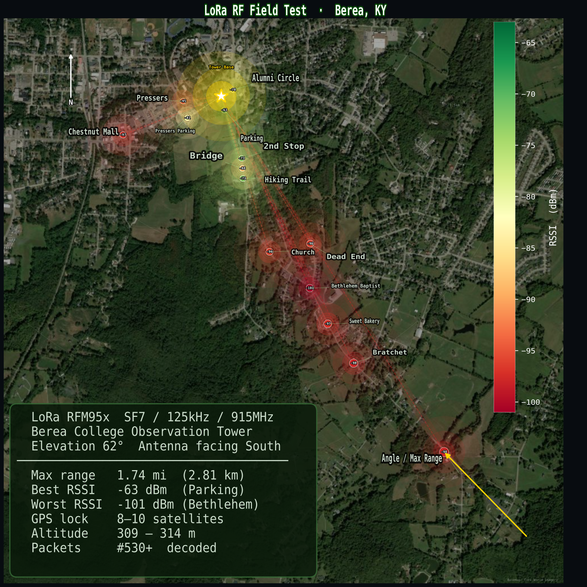
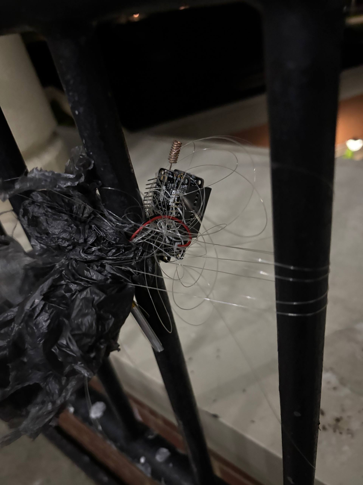

### Day 1 -- testing the radio coveraging

Here, we tested the radio coverage of the equipment

how we attatched the Feather board to at 69 angle to horizon to study the radio signal

Here is an illustration of the balloon flight test, reaching heights of up to 25–30 meters.
